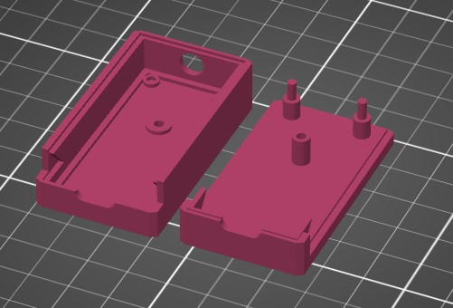
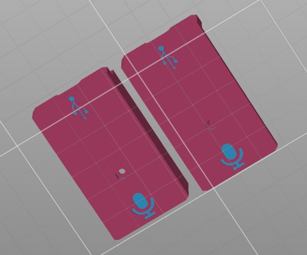
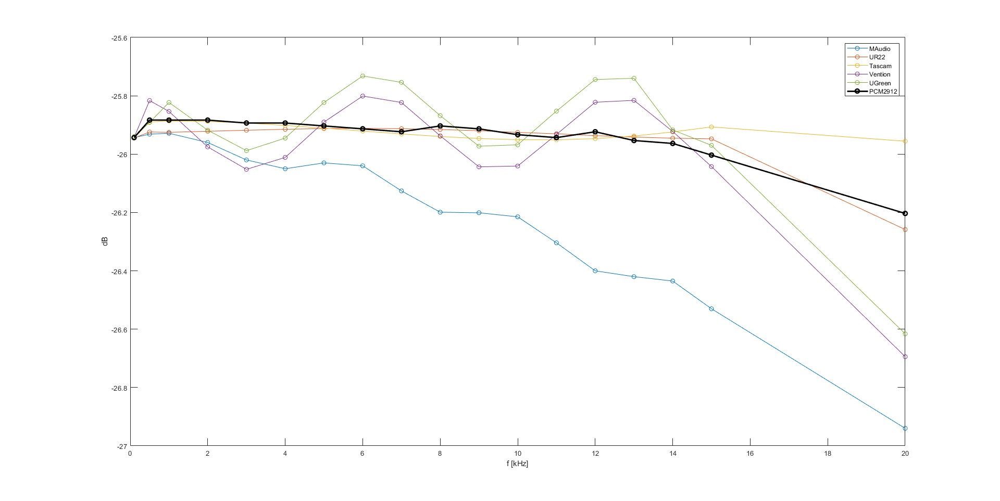

# Condenser soundcard

High gain USB soundcard with 5V power for headset condenser microphones. This repo contains Kicad design files for a USB soundcard using [PCM2912](https://www.ti.com/lit/ds/symlink/pcm2912a.pdf?ts=1744521427834&ref_url=https%253A%252F%252Fwww.ti.com%252Fproduct%252FPCM2912A). PCM2912 is one of a few publicly available USB audio codecs. It contains USB 2.0 FS, mic input with integrated optional 20db pre amp (sadly only hw controlled), L a R outputs. We use this soundcard in our team at FEE CTU to record patients with various neurodegenerative diseases (<https://sami.fel.cvut.cz/>).

## Table of Contents

- [Hardware](#hardware)
  - [Z570M socket](#z570m-socket)
  - [HV power supply board](#hv-power-supply)
  - [Digits and HV5530 board](#digits-and-HV5530-board)
  - [Control board](#control-board)
- [Case](#case)

## Hardware
Headworn condenser microphones need DC bias voltage to work properly. They contain JFET integrated into the microphone capsule, amplifying the signal from the electret element. The voltages have different ranges, depending on manufacturer, but they often include 5V. Since PCM2912 ouputs only 2.7V with 5V USB power, some modifications to the catalogue design were needed. 

The first though was to take the USB power, filter it a bit and voala, you have 5V. That didn't work at all. Altought on the scope, the voltage seemed completely fine and reasonably clear, there was huge noise in the input audio. It turns out, the TI engineers use some technique to get rid of the digital USB noise and as a result AGND is not connected to GND. So don't mess with the grounds on the PCB! 

Since the mic takes only around 200 uA of current, i decided to use charge pump and take that 2.7V from original mic bias and double it. This works fine and doesn't add any noise to the audio path. One thing they don't mention in the datasheet - the bias turns off when microphone is not in use,

Since we manufactured more than 300 of these, i made a 5x6 panel for the assembly using KiKit with custom mousebite positions. The project for that is in the folder "panel".

## Case
In the folder "case" the are stl files for 3D print as well as 3mf files for color print on Prusa multimaterial. The case is from two parts that "click" together. It holds kinda good just like that, but you can secure it using M2 screw (we do that).

    
    

## Measurements
Since we were originally wanted just to buy a finished solution, I measured frequency response of various USB soundcards available in the market.
Here is a frequency response measured using R&S UPV and Audacity. I used the UPV generator to input sine wave into the mic input and then measured DB using Audacity from 4s samples.

Since price for one of these PCM soundards is around 15$ i think it does quite good compared to 180$ Tascam DR-40X.
I also measured the amplitude spectrum using ARTA, there is PCM

 and the DR-40X for comparison.
